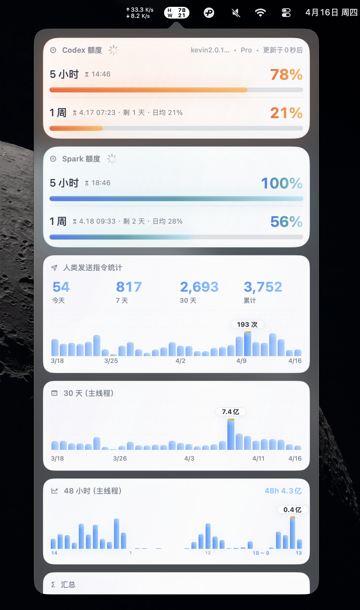

# CodexTokenBar

CodexTokenBar is a macOS menu bar app for tracking Codex / OpenAI quota, token usage, credits, and code review allowance at a glance.

> Fork notice
>
> CodexTokenBar is an independent fork of [CodexBar](https://github.com/steipete/CodexBar), the original project created by Peter Steinberger. This repository starts from the CodexBar codebase, keeps attribution to the upstream project, and is being reshaped into a narrower Codex / OpenAI-focused app. See [docs/fork-origin.md](docs/fork-origin.md) for attribution and scope details.



## Screenshot

CodexTokenBar keeps the important information in one menu bar dashboard:

- quota windows and reset times
- recent 30-day and 48-hour token charts
- today / 7-day / 30-day / cumulative totals
- main-thread scoped summaries

## Overview

### English

CodexTokenBar is a focused Codex / OpenAI menu bar dashboard for macOS.
It shows the numbers people actually check during daily use: remaining quota,
Spark quota, recent token usage, code review allowance, credits, and
main-thread activity.

### 中文

CodexTokenBar 是一个面向 Codex / OpenAI 的 macOS 菜单栏仪表盘。
它把日常最常看的信息直接放到菜单栏弹窗里：剩余额度、Spark 额度、
最近 30 天与 48 小时 token 用量、代码审查额度、Credits，以及主线程统计。

### 日本語

CodexTokenBar は、Codex / OpenAI 向けに絞った macOS のメニューバーダッシュボードです。
日常的に確認したい数値をひとつのポップアップにまとめます。
残りクォータ、Spark クォータ、直近 30 日 / 48 時間の token 使用量、
コードレビュー枠、Credits、メインスレッド統計を確認できます。

## What It Shows

### English

- Codex quota and Spark quota windows
- token usage trends for the last 30 days and 48 hours
- today / 7-day / 30-day / cumulative totals
- main-thread scoped summaries
- credits and code review status when available

### 中文

- Codex 主额度和 Spark 额度
- 最近 30 天、最近 48 小时 token 趋势
- 今日 / 7 天 / 30 天 / 累计汇总
- 主线程口径统计
- 可用时显示 Credits 和代码审查额度

### 日本語

- Codex 本体クォータと Spark クォータ
- 直近 30 日 / 48 時間の token 推移
- 今日 / 7日 / 30日 / 累計の集計
- メインスレッド基準の統計
- 利用可能な場合は Credits とコードレビュー枠

## Download

### GitHub Release

- Latest release: [CodexTokenBar Releases](https://github.com/kevin20999/CodexBar/releases/latest)

### Build From Source

```bash
swift build -c release
./Scripts/package_app.sh
open -n /Applications/CodexTokenBar.app
```

## Focus of this fork

This fork is intentionally narrower than the original CodexBar project. The current direction is:

- Codex / OpenAI dashboard data first
- token, quota, credits, and code review visibility
- fork-specific branding, packaging, and release flow
- a simpler menu bar experience centered on one provider family

If you want the broader multi-provider app, use the original [CodexBar](https://github.com/steipete/CodexBar).

## Privacy

- Browser cookie import is opt-in.
- Dashboard parsing and cache handling stay local to the app.
- No passwords are stored in the repository.

Dev loop:

```bash
./Scripts/compile_and_run.sh
```

CodexDaily-only dev loop:

```bash
./Scripts/compile_and_run_codexdaily.sh
```

Clean local caches and generated artifacts:

```bash
./Scripts/clean_local_artifacts.sh
```

This removes local-only directories such as `.build`, `.tmp-modulecache`, `.artifacts`, `.upstream`, and generated `.app` bundles. They are safe to recreate when you build again. If you prefer package scripts, `npm run clean:local` calls the same command.

## Docs

- [Fork origin and attribution](docs/fork-origin.md)
- [Architecture](docs/architecture.md)
- [CLI reference](docs/cli.md)
- [Provider authoring](docs/provider.md)
- [First-time GitHub Release checklist](docs/GITHUB_RELEASE_FIRST_TIME.md)

## Original project

- Original repository: [steipete/CodexBar](https://github.com/steipete/CodexBar)
- Original author: Peter Steinberger
- Original license: MIT
- Upstream project scope: broader multi-provider menu bar tracking across Codex, Claude, Cursor, Gemini, and other providers

## Credits

CodexTokenBar is based on CodexBar. The original concept, architecture, and much of the foundation come from Peter Steinberger's [CodexBar](https://github.com/steipete/CodexBar). Fork-specific changes in this repository focus on Codex / OpenAI token workflows, branding, and packaging.

## License

MIT. Keep the original license text and attribution intact when redistributing or creating further forks.
